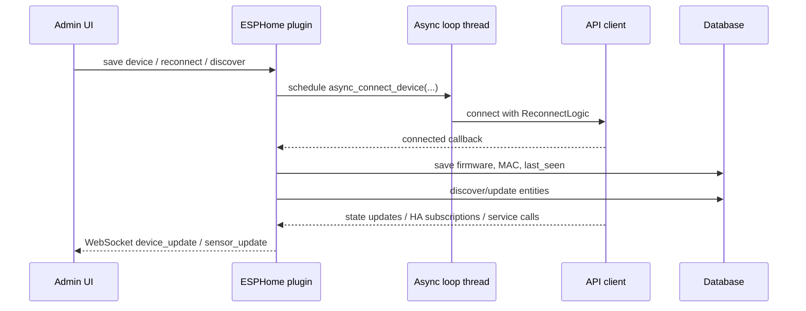
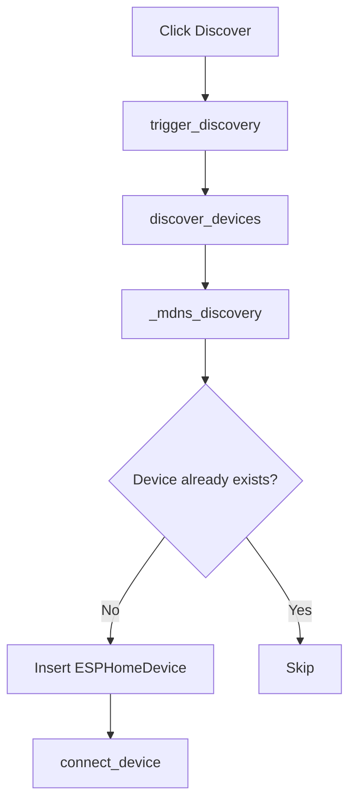

# ESPHome - Technical Reference

## Module Structure

Core files:

| File | Responsibility |
| --- | --- |
| `plugins/ESPHome/__init__.py` | Main plugin lifecycle, linking, connection orchestration |
| `plugins/ESPHome/api.py` | REST API for admin operations |
| `plugins/ESPHome/api_client.py` | Wrapper over `aioesphomeapi.APIClient` |
| `plugins/ESPHome/discovery.py` | mDNS discovery via zeroconf |
| `plugins/ESPHome/models.py` | SQLAlchemy models for devices and entities |
| `plugins/ESPHome/templates/esphome_admin.html` | Admin UI |
| `plugins/ESPHome/static/js/devices.js` | Frontend logic and WebSocket updates |

---

## Runtime Architecture

The plugin starts a dedicated asyncio event loop in a separate thread and schedules async connection tasks into that loop.



### Initialization flow

1. `initialization()` starts a new event loop thread.
2. `load_devices()` loads all enabled devices from the database.
3. Each enabled device is passed to `async_connect_device(...)`.
4. `ESPHomeAPIClient.connect()` starts `ReconnectLogic`.

---

## Data Model

### `ESPHomeDevice`

| Field | Type | Meaning |
| --- | --- | --- |
| `id` | integer | Primary key |
| `name` | string | Device name used as plugin-side identifier |
| `host` | string | Hostname or IP |
| `port` | integer | API port |
| `password` | string | Optional API password |
| `client_info` | string | Optional client identifier sent to ESPHome |
| `firmware_version` | string | Reported ESPHome version |
| `mac_address` | string | Reported MAC address |
| `discovered_at` | datetime | Time the record was created by discovery |
| `last_seen` | datetime | Last successful connection |
| `enabled` | boolean | Controls whether connection attempts are allowed |

### `ESPHomeSensor`

| Field | Type | Meaning |
| --- | --- | --- |
| `id` | integer | Primary key |
| `device_id` | integer | Parent device |
| `entity_key` | string | ESPHome key used for state/command routing |
| `unique_id` | string | Stable entity identifier |
| `name` | string | Display name |
| `entity_type` | string | Entity type such as `sensor`, `light`, `switch`, `homeassistant` |
| `device_class` | string | Class or synthetic descriptor |
| `unit_of_measurement` | string | Unit |
| `icon` | string | Icon identifier |
| `state` | text | JSON-serialized latest state |
| `accuracy_decimals` | integer | Display/rounding precision |
| `links` | text | JSON mapping of `attribute -> Object.property|Object.method` |
| `last_updated` | datetime | Latest state timestamp |
| `discovered_at` | datetime | Discovery timestamp |
| `enabled` | boolean | Enables reverse-control processing |

---

## Supported Entity Types

### Read path

The plugin can store and process any entity returned by `list_entities_services()`, but several types receive special handling:

| Entity type | Read behavior |
| --- | --- |
| `sensor` | Uses `state.state` |
| `light` | Normalizes `state`, optional `brightness`, optional `rgb` |
| other ESPHome states | Uses `state.to_dict()` and strips internal keys |
| `homeassistant` | Virtual entity maintained from subscription/service callbacks |

### Control path

Reverse control is explicitly implemented for:

| Entity type | Command used |
| --- | --- |
| `homeassistant` | `send_home_assistant_state(...)` |
| `switch` | `switch_command(...)` |
| `number` | `number_command(...)` |
| `text` / `textsensor` | `text_command(...)` |
| `light` | `light_command(...)` |
| `cover` | `cover_command(...)` |

> [!NOTE]
> `binarysensor` and most telemetry-only entities are typically read-only from the module perspective.

---

## Discovery

Discovery is implemented in `ESPHomeDiscovery`.

Mechanism:

- uses `zeroconf.ServiceBrowser`;
- listens to `_esphomelib._tcp.local.`;
- sleeps for the discovery timeout;
- converts service info into dictionaries with `name`, `host`, `port`;
- appends decoded TXT properties when available.

### Discovery flow



Limitations:

- if `zeroconf` is not installed, discovery is skipped with a warning;
- duplicate detection is based on `host + port`;
- discovery is manual from the admin page in the current implementation.

---

## Connection Lifecycle

### Establishing a connection

`async_connect_device(...)` creates an `ESPHomeAPIClient`, registers callbacks, stores it in `api_clients`, and calls `connect()`.

Callbacks registered:

- `connected_callback`
- `state_callback`
- `ha_subscribe_callback`
- `service_callback`

### On successful connect

`on_connected(...)`:

1. reads `device_info`;
2. updates `firmware_version`, `mac_address`, `last_seen`;
3. discovers device entities and synchronizes them into the database;
4. sends WebSocket `device_update`.

### Reconnect/update behavior

`update_connections(device)`:

- reloads the device from the database by ID;
- disconnects and removes the old client if present;
- sends disconnected status to the UI;
- reconnects only if `enabled == True`.

### Shutdown

`stop_cycle()` disconnects all connected clients, stops the loop, and then delegates to `BasePlugin.stop_cycle()`.

---

## State Processing

### State normalization

`_getStates(...)` converts incoming ESPHome states into a JSON-friendly dictionary.

Special cases:

- for `SensorState`, it stores only `state`;
- for `LightState`, it stores:
  - `state`
  - `brightness` in percent
  - `rgb` as hex when RGB mode is active
- for generic states, it uses `to_dict()` and removes internal keys like `key`, `device_id`, and `missing_state`;
- `NaN` values are converted to `null`.

### Accuracy handling

If `accuracy_decimals` is set, numeric values are rounded before being saved.

### Persistence and UI updates

Each state update:

1. finds the target sensor by `device_id + entity_key`;
2. updates `sensor.state`;
3. updates `sensor.last_updated`;
4. processes links;
5. sends `sensor_update` over WebSocket.

---

## Linking Semantics

Links are stored as JSON:

```json
{
  "state": "Weather.outdoor_temperature",
  "brightness": "Light1.brightness",
  "rgb": "Light1.color"
}
```

### Property links

If the link target is not recognized as a method, the plugin uses:

```python
updateProperty(link, value, self.name)
```

### Method links

If the link looks like `Object.member` and `member` exists in `object.methods`, the plugin calls:

```python
callMethodThread(link, method_args, self.name)
```

Method arguments include:

| Key | Meaning |
| --- | --- |
| `VALUE` | Current incoming value |
| `NEW_VALUE` | Same value, for compatibility |
| `service_name` | Source context such as `state_update` or an HA service name |
| `attribute_name` | Specific sensor/service attribute |

### Reverse direction

When an osysHome property changes, `changeLinkedProperty(obj, prop, val)`:

1. searches sensors whose `links` contain `Object.property`;
2. removes stale object links if no matching sensors remain;
3. routes the new value to `_control_linked_sensor(...)`.

---

## Special Control Rules

### `switch`

Input is converted with `convert_to_boolean(...)`.

### `number`

Value is passed as-is to `number_command`.

### `text` / `textsensor`

Value is stringified and sent to `text_command`.

### `light`

Two modes exist:

1. Simple mode: when the changed linked attribute is `state`, the plugin sends just on/off.
2. Composite mode: when another linked light attribute changes, the plugin re-reads linked values for:
   - `state`
   - `brightness`
   - `rgb`

Then it sends one combined `light_command(...)`.

### `cover`

The mapping is:

| Incoming value | Command |
| --- | --- |
| `open`, `1`, `true` | `position=1.0` |
| `close`, `0`, `false` | `position=0.0` |
| anything else | `stop=True` |

---

## Home Assistant Bridge Behavior

The module always subscribes to Home Assistant states and services through the ESPHome API client after connect.

### State subscription callback

`on_ha_subscribe_callback(device, entity_id, attribute)`:

- creates a virtual sensor of type `homeassistant` if needed;
- ensures the requested attribute exists in `links`;
- if the attribute is already linked, reads the current osysHome value and sends it back to ESPHome with `send_home_assistant_state(...)`.

### Service callback

`on_service_callback(device, service)`:

- extracts `service`, `data`, `variables`, `data_template`;
- resolves `entity_id`;
- builds a normalized parameter dictionary;
- creates a virtual `homeassistant` sensor if missing;
- merges incoming values into the stored JSON `state`;
- adds any newly observed parameters into `links`;
- processes linked targets for each parameter;
- emits `sensor_update` to the UI.

> [!IMPORTANT]
> This allows ESPHome devices to interact with osysHome as if osysHome were providing HA-compatible state and service responses.

---

## REST API

Namespace path:

```text
/api/ESPHome
```

All listed endpoints require:

- API key authentication
- admin permission handling

### `GET /devices`

Returns all devices with their sensors, current parsed states, links, and connection status.

### `GET /device/<device_id>/sensors`

Returns a rendered sensor editor page for the selected device.

### `GET /reconnect/<device_id>`

Reloads device settings from the database and reconnects that device.

### `POST /device`

Creates or updates a device and persists sensor links.

Important behaviors:

- validates that `host` and `name` are present;
- reconnects when connection parameters or `enabled` change;
- removes old object-property subscriptions before applying updated links;
- registers new object-property subscriptions through `setLinkToObject(...)`.

### `DELETE /device?id=<id>`

Deletes the device and all related sensor records, then removes the active client.

---

## WebSocket Integration

The admin frontend subscribes to `ESPHome` data and expects these payloads:

### `device_update`

Example:

```json
{
  "device": "living-room-node",
  "state": true
}
```

### `sensor_update`

Example:

```json
{
  "device": "living-room-node",
  "sensor": "Temperature",
  "state": {
    "state": 23.4
  },
  "key": "12"
}
```

The frontend updates the in-memory Vue device tree in place.

---

## Frontend Behavior

`static/js/devices.js` implements:

- initial device fetch from `/api/ESPHome/devices`;
- object list fetch from `/api/object/list/details`;
- Socket.IO subscription to `ESPHome`;
- modal editing for devices and links;
- sensor link editor supporting both properties and methods.

### Sensor link editor logic

For each known sensor attribute, the UI lets the user choose:

- object;
- property;
- method.

The saved result is always flattened into a string:

```text
Object.property
```

or:

```text
Object.method
```

---

## Known Caveats

> [!WARNING]
> There is a call to `callMethod(...)` inside `_read_link_value(...)`, but only `callMethodThread` is imported in `__init__.py`. If a method link is ever read back through `_read_link_value`, this path may fail unless `callMethod` is available from broader runtime context.

Other caveats:

- `cycle` exists as an action, but the async periodic connection refresh is currently commented out in `cyclic_task()`;
- the API route `/device/<device_id>/sensors` renders `sensor_editor.html`, but that template is not present inside the plugin directory in the current source tree;
- device uniqueness on discovery is based on `host` and `port`, not name;
- UI text is partly localized, but several internal strings remain English-centric.

---

## Summary

The `ESPHome` module is a hybrid integration layer:

- device connector;
- state synchronizer;
- command bridge;
- object-link dispatcher;
- Home Assistant compatibility adapter for ESPHome callbacks.

See also:

- [User Guide](USER_GUIDE.md)
- [Module index](index.md)
