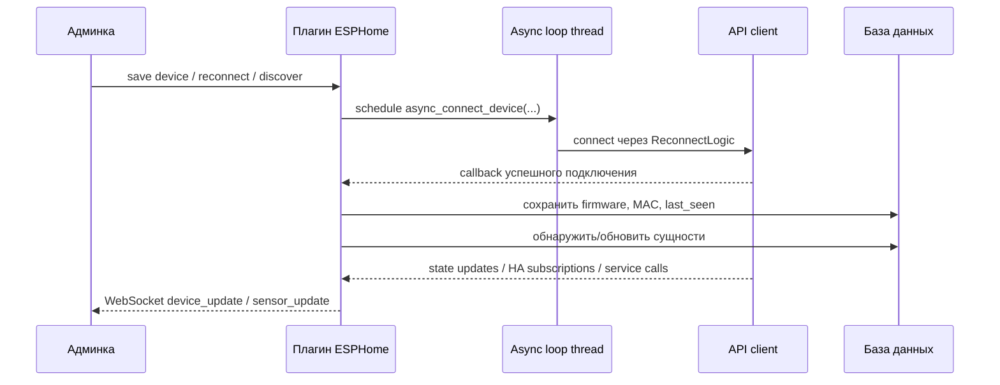
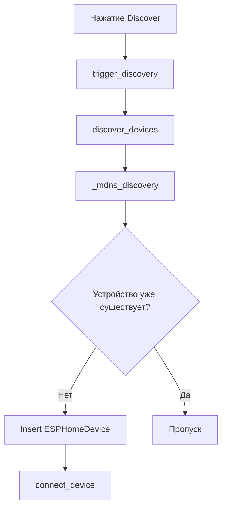

# ESPHome - Техническая документация

## Структура модуля

Основные файлы:

| Файл | Назначение |
| --- | --- |
| `plugins/ESPHome/__init__.py` | Жизненный цикл плагина, связи, оркестрация подключений |
| `plugins/ESPHome/api.py` | REST API для административных операций |
| `plugins/ESPHome/api_client.py` | Обёртка над `aioesphomeapi.APIClient` |
| `plugins/ESPHome/discovery.py` | mDNS-обнаружение через zeroconf |
| `plugins/ESPHome/models.py` | SQLAlchemy-модели устройств и сущностей |
| `plugins/ESPHome/templates/esphome_admin.html` | Административный интерфейс |
| `plugins/ESPHome/static/js/devices.js` | Фронтенд-логика и WebSocket-обновления |

---

## Архитектура выполнения

Плагин поднимает отдельный asyncio event loop в отдельном потоке и планирует асинхронные задачи подключения именно в этот loop.



### Поток инициализации

1. `initialization()` запускает новый event loop в отдельном потоке.
2. `load_devices()` загружает все включённые устройства из базы.
3. Каждое включённое устройство передаётся в `async_connect_device(...)`.
4. `ESPHomeAPIClient.connect()` запускает `ReconnectLogic`.

---

## Модель данных

### `ESPHomeDevice`

| Поле | Тип | Смысл |
| --- | --- | --- |
| `id` | integer | Первичный ключ |
| `name` | string | Имя устройства, используемое как идентификатор в плагине |
| `host` | string | Hostname или IP |
| `port` | integer | Порт API |
| `password` | string | Необязательный пароль API |
| `client_info` | string | Необязательный идентификатор клиента, отправляемый в ESPHome |
| `firmware_version` | string | Сообщённая версия ESPHome |
| `mac_address` | string | Сообщённый MAC-адрес |
| `discovered_at` | datetime | Время создания записи через discovery |
| `last_seen` | datetime | Последнее успешное подключение |
| `enabled` | boolean | Управляет разрешением на попытки подключения |

### `ESPHomeSensor`

| Поле | Тип | Смысл |
| --- | --- | --- |
| `id` | integer | Первичный ключ |
| `device_id` | integer | Родительское устройство |
| `entity_key` | string | Ключ ESPHome для маршрутизации состояний и команд |
| `unique_id` | string | Стабильный идентификатор сущности |
| `name` | string | Отображаемое имя |
| `entity_type` | string | Тип сущности, например `sensor`, `light`, `switch`, `homeassistant` |
| `device_class` | string | Класс устройства или синтетический дескриптор |
| `unit_of_measurement` | string | Единица измерения |
| `icon` | string | Идентификатор иконки |
| `state` | text | JSON с последним состоянием |
| `accuracy_decimals` | integer | Точность округления |
| `links` | text | JSON вида `attribute -> Object.property|Object.method` |
| `last_updated` | datetime | Время последнего обновления |
| `discovered_at` | datetime | Время обнаружения |
| `enabled` | boolean | Включает обработку обратного управления |

---

## Поддерживаемые типы сущностей

### Путь чтения

Плагин может сохранять и обрабатывать любую сущность, которую возвращает `list_entities_services()`, но для некоторых типов есть специальная логика:

| Тип сущности | Поведение при чтении |
| --- | --- |
| `sensor` | Использует `state.state` |
| `light` | Нормализует `state`, опционально `brightness`, опционально `rgb` |
| другие состояния ESPHome | Использует `state.to_dict()` и убирает внутренние ключи |
| `homeassistant` | Виртуальная сущность, поддерживаемая через callbacks подписок и сервисов |

### Путь управления

Обратное управление явно реализовано для:

| Тип сущности | Используемая команда |
| --- | --- |
| `homeassistant` | `send_home_assistant_state(...)` |
| `switch` | `switch_command(...)` |
| `number` | `number_command(...)` |
| `text` / `textsensor` | `text_command(...)` |
| `light` | `light_command(...)` |
| `cover` | `cover_command(...)` |

> [!NOTE]
> `binarysensor` и большинство чисто телеметрических сущностей обычно работают только на чтение.

---

## Обнаружение устройств

Поиск реализован в `ESPHomeDiscovery`.

Механика:

- использует `zeroconf.ServiceBrowser`;
- слушает `_esphomelib._tcp.local.`;
- ждёт истечения discovery timeout;
- преобразует сервис в словари с `name`, `host`, `port`;
- добавляет декодированные TXT-свойства, если они есть.

### Схема discovery



Ограничения:

- если `zeroconf` не установлен, discovery пропускается с предупреждением;
- защита от дублей основана на `host + port`;
- в текущей реализации поиск запускается вручную из админки.

---

## Жизненный цикл подключения

### Установка соединения

`async_connect_device(...)` создаёт `ESPHomeAPIClient`, регистрирует callbacks, сохраняет его в `api_clients` и вызывает `connect()`.

Регистрируемые callbacks:

- `connected_callback`
- `state_callback`
- `ha_subscribe_callback`
- `service_callback`

### После успешного подключения

`on_connected(...)`:

1. читает `device_info`;
2. обновляет `firmware_version`, `mac_address`, `last_seen`;
3. обнаруживает сущности устройства и синхронизирует их с базой;
4. отправляет WebSocket `device_update`.

### Поведение при переподключении и обновлении

`update_connections(device)`:

- заново загружает устройство из базы по ID;
- отключает и удаляет старый клиент, если он есть;
- отправляет в UI статус отключения;
- переподключает устройство только если `enabled == True`.

### Завершение работы

`stop_cycle()` отключает все подключённые клиенты, останавливает loop, после чего вызывает `BasePlugin.stop_cycle()`.

---

## Обработка состояний

### Нормализация состояния

`_getStates(...)` преобразует входящие состояния ESPHome в словарь, пригодный для JSON.

Специальные случаи:

- для `SensorState` сохраняется только `state`;
- для `LightState` сохраняются:
  - `state`
  - `brightness` в процентах
  - `rgb` в hex, если активен RGB-режим
- для остальных состояний используется `to_dict()` с удалением внутренних ключей `key`, `device_id` и `missing_state`;
- значения `NaN` превращаются в `null`.

### Работа с точностью

Если задан `accuracy_decimals`, числовые значения округляются перед сохранением.

### Сохранение и обновление UI

Каждое изменение состояния:

1. находит сенсор по `device_id + entity_key`;
2. обновляет `sensor.state`;
3. обновляет `sensor.last_updated`;
4. обрабатывает связи;
5. отправляет `sensor_update` через WebSocket.

---

## Семантика связей

Связи хранятся в JSON:

```json
{
  "state": "Weather.outdoor_temperature",
  "brightness": "Light1.brightness",
  "rgb": "Light1.color"
}
```

### Связи со свойствами

Если цель связи не распознана как метод, плагин использует:

```python
updateProperty(link, value, self.name)
```

### Связи с методами

Если ссылка выглядит как `Object.member` и `member` существует в `object.methods`, плагин вызывает:

```python
callMethodThread(link, method_args, self.name)
```

Аргументы метода включают:

| Ключ | Значение |
| --- | --- |
| `VALUE` | Текущее входящее значение |
| `NEW_VALUE` | То же значение для совместимости |
| `service_name` | Контекст источника, например `state_update` или имя HA-сервиса |
| `attribute_name` | Конкретный атрибут сенсора или сервиса |

### Обратное направление

Когда в osysHome меняется свойство, `changeLinkedProperty(obj, prop, val)`:

1. ищет сенсоры, чьи `links` содержат `Object.property`;
2. удаляет устаревшие object-links, если подходящих сенсоров больше нет;
3. передаёт новое значение в `_control_linked_sensor(...)`.

---

## Специальные правила управления

### `switch`

Входное значение преобразуется через `convert_to_boolean(...)`.

### `number`

Значение без изменений передаётся в `number_command`.

### `text` / `textsensor`

Значение приводится к строке и отправляется в `text_command`.

### `light`

Есть два режима:

1. Простой режим: если изменился связанный атрибут `state`, плагин отправляет только on/off.
2. Составной режим: если изменился другой атрибут света, плагин заново читает связанные значения:
   - `state`
   - `brightness`
   - `rgb`

После этого отправляется одна объединённая команда `light_command(...)`.

### `cover`

Используется такое сопоставление:

| Входящее значение | Команда |
| --- | --- |
| `open`, `1`, `true` | `position=1.0` |
| `close`, `0`, `false` | `position=0.0` |
| любое другое | `stop=True` |

---

## Поведение моста Home Assistant

После подключения модуль всегда подписывается на состояния и сервисы Home Assistant через ESPHome API client.

### Callback подписок на состояния

`on_ha_subscribe_callback(device, entity_id, attribute)`:

- создаёт виртуальный сенсор типа `homeassistant`, если его ещё нет;
- гарантирует наличие нужного атрибута в `links`;
- если атрибут уже связан, читает текущее значение из osysHome и отправляет его обратно в ESPHome через `send_home_assistant_state(...)`.

### Callback сервисов

`on_service_callback(device, service)`:

- извлекает `service`, `data`, `variables`, `data_template`;
- определяет `entity_id`;
- строит нормализованный словарь параметров;
- создаёт виртуальный сенсор `homeassistant`, если он отсутствует;
- объединяет входящие значения с сохранённым JSON в `state`;
- добавляет новые параметры в `links`;
- обрабатывает связанные цели для каждого параметра;
- отправляет `sensor_update` в UI.

> [!IMPORTANT]
> Благодаря этому устройства ESPHome могут взаимодействовать с osysHome так, будто osysHome предоставляет совместимые с HA состояния и ответы на сервисы.

---

## REST API

Путь namespace:

```text
/api/ESPHome
```

Все перечисленные endpoints требуют:

- аутентификацию по API key;
- проверку прав администратора

### `GET /devices`

Возвращает все устройства вместе с их сенсорами, распарсенными состояниями, связями и статусом подключения.

### `GET /device/<device_id>/sensors`

Возвращает отрендеренную страницу редактора сенсоров выбранного устройства.

### `GET /reconnect/<device_id>`

Заново загружает настройки устройства из базы и переподключает его.

### `POST /device`

Создаёт или обновляет устройство и сохраняет связи сенсоров.

Важные особенности:

- проверяет наличие `host` и `name`;
- переподключает устройство при изменении параметров подключения или `enabled`;
- удаляет старые подписки на object-property перед применением новых связей;
- регистрирует новые object-property связи через `setLinkToObject(...)`.

### `DELETE /device?id=<id>`

Удаляет устройство и все связанные записи сенсоров, после чего убирает активный клиент.

---

## Интеграция с WebSocket

Админский фронтенд подписывается на данные `ESPHome` и ожидает такие payload:

### `device_update`

Пример:

```json
{
  "device": "living-room-node",
  "state": true
}
```

### `sensor_update`

Пример:

```json
{
  "device": "living-room-node",
  "sensor": "Temperature",
  "state": {
    "state": 23.4
  },
  "key": "12"
}
```

Фронтенд обновляет Vue-дерево устройств прямо в памяти.

---

## Поведение фронтенда

`static/js/devices.js` реализует:

- начальную загрузку устройств из `/api/ESPHome/devices`;
- загрузку списка объектов из `/api/object/list/details`;
- подписку Socket.IO на `ESPHome`;
- модальные окна для редактирования устройств и связей;
- редактор связей сенсоров с поддержкой и свойств, и методов.

### Логика редактора связей

Для каждого известного атрибута сенсора UI позволяет выбрать:

- объект;
- свойство;
- метод.

Сохраняемый результат всегда приводится к строке:

```text
Object.property
```

или:

```text
Object.method
```

---

## Известные нюансы

> [!WARNING]
> Внутри `_read_link_value(...)` есть вызов `callMethod(...)`, но в `__init__.py` импортирован только `callMethodThread`. Если когда-либо понадобится читать значение через method-link, этот путь может завершиться ошибкой, если `callMethod` не доступен из более широкого runtime-контекста.

Другие нюансы:

- действие `cycle` существует, но асинхронное периодическое обновление соединений сейчас закомментировано в `cyclic_task()`;
- маршрут `/device/<device_id>/sensors` рендерит `sensor_editor.html`, но такого шаблона сейчас нет в каталоге плагина;
- уникальность устройства при discovery определяется по `host` и `port`, а не по имени;
- UI локализован частично, но часть внутренних строк всё ещё ориентирована на английский.

---

## Резюме

Модуль `ESPHome` это гибридный слой интеграции:

- коннектор устройств;
- синхронизатор состояний;
- мост команд;
- диспетчер связей с объектами;
- адаптер Home Assistant-совместимых callbacks для ESPHome.

См. также:

- [Руководство пользователя](USER_GUIDE.ru.md)
- [Индекс модуля](index.ru.md)
