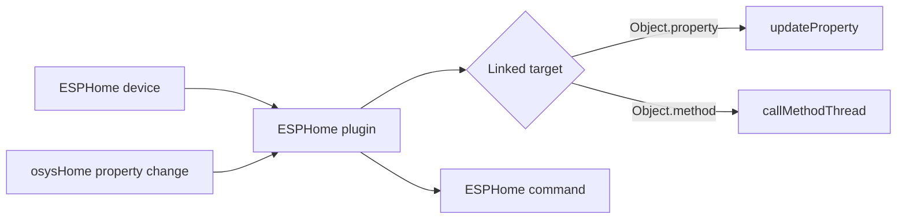

# ESPHome - User Guide


## Purpose

`ESPHome` is a device integration module for osysHome that connects to ESPHome nodes through the native ESPHome API.

The module is designed to:

- discover ESPHome devices on the local network via mDNS;
- connect to enabled devices in the background;
- read states from sensors and controllable entities;
- link ESPHome values to osysHome object properties;
- call osysHome object methods when ESPHome values change;
- send values from osysHome back to ESPHome entities;
- proxy Home Assistant state and service interactions exposed by ESPHome.

> [!IMPORTANT]
> The module does not only monitor devices. It supports bidirectional integration: ESPHome -> osysHome and osysHome -> ESPHome.

---

## What the User Gets

After setup, the module provides:

| Capability | What it does |
| --- | --- |
| Device discovery | Finds ESPHome nodes announced through `_esphomelib._tcp.local.` |
| Device registry | Stores devices in `esphome_devices` |
| Entity registry | Stores discovered entities in `esphome_sensors` |
| Live updates | Pushes `device_update` and `sensor_update` via WebSocket |
| Linking | Binds entity attributes to `Object.property` or `Object.method` |
| Control | Sends commands to switches, lights, covers, numbers, text entities, and HA-backed entities |

---

## Interface Overview

The admin page is available at:

```text
/admin/ESPHome
```

Main UI actions:

1. `Add Device`
2. `Discover`
3. `Edit Sensors`
4. `Reconnect`
5. `Edit`
6. `Delete`

### Device list columns

| Column | Meaning |
| --- | --- |
| Name | Friendly name and `host:port` |
| Status | `Connected`, `Disconnected`, or `Disabled` |
| Sensors | Number of known entities |
| Version | ESPHome firmware version if the device reported it |
| Last Seen | Last successful connection timestamp |
| Actions | Open sensor links, reconnect, edit, delete |

### Device card status logic

- `Disabled` means the device is stored in the database but the module will not connect to it.
- `Connected` means the API client exists and reports an active connection.
- `Disconnected` means the device is enabled but currently offline or unavailable.

> [!TIP]
> If the device appears in the list but has no sensors yet, use `Reconnect` after checking host, port, password, and API availability.

---

## Quick Start Checklist

- [ ] Make sure the ESPHome node exposes the native API.
- [ ] Open `/admin/ESPHome`.
- [ ] Click `Discover` or add the device manually.
- [ ] Fill in `name`, `host`, `port`, optional `password`, optional `client_info`.
- [ ] Leave `enabled` turned on.
- [ ] Save the device and wait for connection.
- [ ] Open sensor settings and bind values to osysHome properties or methods.

---

## Adding a Device

You can add a device in two ways.

### Option 1. Automatic discovery

The module uses mDNS discovery and searches for `_esphomelib._tcp.local.` services.

Discovered data includes:

- device name;
- IP address;
- API port;
- TXT records returned by zeroconf.

If a device with the same `host` and `port` is not already stored, it is added automatically and the module attempts to connect immediately.

### Option 2. Manual device creation

Use the `Add Device` button and fill in:

| Field | Required | Description |
| --- | --- | --- |
| `name` | Yes | Unique device name inside the module |
| `host` | Yes | IP address or hostname |
| `port` | No | ESPHome API port, default `6053` |
| `password` | No | ESPHome API password |
| `client_info` | No | Client identifier sent to the ESPHome API |
| `enabled` | No | Allows or blocks connection attempts |

### Example configuration

```yaml
device:
  name: living-room-node
  host: 192.168.1.45
  port: 6053
  password: ""
  client_info: osysHome
  enabled: true
```

---

## How Linking Works

Each ESPHome entity may expose one or several attributes in its current state.

Examples:

- a regular sensor usually exposes `state`;
- a light may expose `state`, `brightness`, `rgb`;
- a Home Assistant service-backed entity may expose multiple named parameters.

Each attribute can be linked to:

- an osysHome property: `Object.property`
- an osysHome method: `Object.method`

### Property link

If the link points to a property, the module updates that property when ESPHome sends a new value.

Example:

```text
Climate.outdoor_temp
```

### Method link

If the link points to an object method, the module calls that method instead of writing a property.

The method receives arguments like:

```json
{
  "VALUE": 23.7,
  "NEW_VALUE": 23.7,
  "service_name": "state_update",
  "attribute_name": "state"
}
```

> [!NOTE]
> Method links are resolved dynamically by checking whether the second segment exists in `object.methods`.

### Visual model



---

## Supported User Scenarios

### Read sensor values into osysHome

Link `state` from a sensor to a property like:

```text
Weather.outdoor_temperature
```

### Trigger business logic from a binary state

Link an ESPHome attribute to a method like:

```text
Alarm.motionDetected
```

When the state changes, the method is called.

### Control an ESPHome switch from osysHome

Bind an ESPHome `switch` entity to a property. When that property changes inside osysHome, the module converts the incoming value to boolean and sends `switch_command`.

### Control a light with multiple linked values

For `light` entities, you can combine:

- `state`
- `brightness`
- `rgb`

The module reads linked values and sends one combined light command.

Example:

| Light attribute | Link |
| --- | --- |
| `state` | `Light1.state` |
| `brightness` | `Light1.brightness` |
| `rgb` | `Light1.color` |

### Use Home Assistant subscriptions

If the ESPHome node asks osysHome for Home Assistant state subscriptions or emits HA service calls, the module creates or updates a virtual entity of type `homeassistant` and uses its links the same way as for regular ESPHome entities.

---

## Entity Types the User Will Encounter

| Entity type | Typical behavior |
| --- | --- |
| `sensor` | Read-only telemetry |
| `binarysensor` | Binary state updates |
| `switch` | On/off control |
| `light` | On/off, brightness, RGB |
| `cover` | Open, close, stop |
| `number` | Numeric command |
| `text` / `textsensor` | Text command or text state |
| `homeassistant` | Virtual entity built from HA subscriptions/services |

---

## WebSocket Updates in the UI

The admin page subscribes to module data with:

```javascript
this.socket.emit('subscribeData', ['ESPHome']);
```

The plugin pushes:

- `device_update`
- `sensor_update`

This keeps the device list and entity states up to date without reloading the page.

---

## Troubleshooting

> [!WARNING]
> Discovery depends on `zeroconf`. If the library is missing, mDNS search is skipped.

### Device was discovered but does not connect

Check:

- correct host and port;
- ESPHome native API is enabled;
- API password matches the device configuration;
- the device remains `enabled` in the module;
- the node is reachable from the osysHome server.

### Device connects but no entities appear

Possible causes:

- the device disconnects before entity listing finishes;
- ESPHome API access is unstable;
- the node exposes no entities compatible with the current API list;
- the initial connect failed and the page needs a reconnect or refresh.

### Links do not react

Check:

- the sensor attribute really exists in the current state;
- the link is saved in the sensor editor;
- the target object and property or method name are valid;
- for methods, the name must exist in `object.methods`;
- for reverse control, the sensor itself must remain enabled.

### Light control behaves unexpectedly

For multi-attribute light control:

- make sure `state`, `brightness`, and `rgb` links all point to valid values;
- brightness is expected in percent and internally converted to `0..1`;
- color is expected as a hex string such as `#DA690A`.

---

## Notes and Limitations

- Discovery is manual from the admin page; the commented config section suggests future automation, but it is not active in the current UI.
- The module stores sensor links as JSON and applies them attribute by attribute.
- `last_seen` is updated on successful connect.
- A disabled device stays in the database and UI but is intentionally disconnected.

> [!CAUTION]
> Renaming a device causes the plugin to remove the old active client and create a new connection path for the new name.

---

## See Also

- [Technical Reference](TECHNICAL_REFERENCE.md)
- [Module index](index.md)

[^1]: The module stores both physical ESPHome entities and virtual `homeassistant` entities in the same sensor table.
