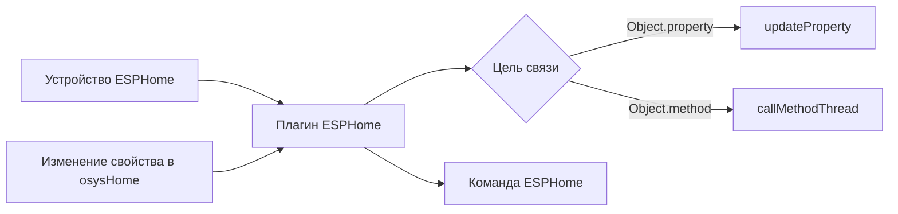

# ESPHome - Руководство пользователя


## Назначение

`ESPHome` это модуль интеграции устройств для osysHome, который подключается к узлам ESPHome через нативный ESPHome API.

Модуль нужен, чтобы:

- находить устройства ESPHome в локальной сети через mDNS;
- подключать включённые устройства в фоне;
- читать состояния сенсоров и управляемых сущностей;
- связывать значения ESPHome со свойствами объектов osysHome;
- вызывать методы объектов osysHome при изменении значений ESPHome;
- отправлять значения из osysHome обратно в сущности ESPHome;
- проксировать подписки на состояния и сервисы Home Assistant, которые запрашивает ESPHome.

> [!IMPORTANT]
> Модуль не только мониторит устройства. Он поддерживает двустороннюю интеграцию: ESPHome -> osysHome и osysHome -> ESPHome.

---

## Что получает пользователь

После настройки модуль даёт:

| Возможность | Что делает |
| --- | --- |
| Поиск устройств | Находит узлы ESPHome, объявленные через `_esphomelib._tcp.local.` |
| Реестр устройств | Сохраняет устройства в `esphome_devices` |
| Реестр сущностей | Сохраняет найденные сущности в `esphome_sensors` |
| Живые обновления | Отправляет `device_update` и `sensor_update` через WebSocket |
| Связи | Привязывает атрибуты сущностей к `Object.property` или `Object.method` |
| Управление | Отправляет команды в `switch`, `light`, `cover`, `number`, `text` и HA-backed сущности |

---

## Обзор интерфейса

Страница администратора доступна по адресу:

```text
/admin/ESPHome
```

Основные действия в интерфейсе:

1. `Add Device`
2. `Discover`
3. `Edit Sensors`
4. `Reconnect`
5. `Edit`
6. `Delete`

### Колонки списка устройств

| Колонка | Значение |
| --- | --- |
| Name | Понятное имя и `host:port` |
| Status | `Connected`, `Disconnected` или `Disabled` |
| Sensors | Число известных сущностей |
| Version | Версия прошивки ESPHome, если устройство её сообщило |
| Last Seen | Время последнего успешного подключения |
| Actions | Открыть связи сущностей, переподключить, изменить, удалить |

### Логика статусов устройства

- `Disabled` означает, что устройство сохранено в базе, но модуль не будет к нему подключаться.
- `Connected` означает, что API-клиент существует и сообщает об активном соединении.
- `Disconnected` означает, что устройство включено, но сейчас недоступно или офлайн.

> [!TIP]
> Если устройство есть в списке, но у него ещё нет сенсоров, нажмите `Reconnect` после проверки host, port, password и доступности API.

---

## Чек-лист быстрого запуска

- [ ] Убедитесь, что на узле ESPHome включён native API.
- [ ] Откройте `/admin/ESPHome`.
- [ ] Нажмите `Discover` или добавьте устройство вручную.
- [ ] Заполните `name`, `host`, `port`, необязательные `password` и `client_info`.
- [ ] Оставьте `enabled` включённым.
- [ ] Сохраните устройство и дождитесь подключения.
- [ ] Откройте настройки сенсоров и привяжите значения к свойствам или методам osysHome.

---

## Добавление устройства

Есть два способа добавить устройство.

### Вариант 1. Автообнаружение

Модуль использует mDNS и ищет сервисы `_esphomelib._tcp.local.`.

При обнаружении извлекаются:

- имя устройства;
- IP-адрес;
- порт API;
- TXT-записи, которые вернул zeroconf.

Если устройство с таким же `host` и `port` ещё не сохранено, оно автоматически добавляется, после чего модуль сразу пытается подключиться.

### Вариант 2. Ручное создание устройства

Нажмите `Add Device` и заполните:

| Поле | Обязательно | Описание |
| --- | --- | --- |
| `name` | Да | Уникальное имя устройства внутри модуля |
| `host` | Да | IP-адрес или hostname |
| `port` | Нет | Порт ESPHome API, по умолчанию `6053` |
| `password` | Нет | Пароль ESPHome API |
| `client_info` | Нет | Идентификатор клиента, который отправляется в ESPHome API |
| `enabled` | Нет | Разрешает или запрещает попытки подключения |

### Пример конфигурации

```yaml
device:
  name: living-room-node
  host: 192.168.1.45
  port: 6053
  password: ""
  client_info: osysHome
  enabled: true
```

---

## Как работают связи

Каждая сущность ESPHome может иметь одно или несколько полей в текущем состоянии.

Примеры:

- обычный сенсор чаще всего имеет `state`;
- свет может иметь `state`, `brightness`, `rgb`;
- сущность, построенная на сервисах Home Assistant, может иметь несколько именованных параметров.

Каждый атрибут можно привязать к:

- свойству osysHome: `Object.property`
- методу osysHome: `Object.method`

### Связь со свойством

Если связь указывает на свойство, модуль обновляет это свойство при получении нового значения от ESPHome.

Пример:

```text
Climate.outdoor_temp
```

### Связь с методом

Если связь указывает на метод объекта, модуль вызывает метод вместо записи в свойство.

Метод получает аргументы вида:

```json
{
  "VALUE": 23.7,
  "NEW_VALUE": 23.7,
  "service_name": "state_update",
  "attribute_name": "state"
}
```

> [!NOTE]
> Метод определяется динамически: модуль проверяет, существует ли вторая часть ссылки в `object.methods`.

### Визуальная схема



---

## Поддерживаемые пользовательские сценарии

### Чтение значений сенсоров в osysHome

Привяжите `state` от сенсора к свойству:

```text
Weather.outdoor_temperature
```

### Запуск логики по бинарному состоянию

Привяжите атрибут ESPHome к методу:

```text
Alarm.motionDetected
```

При изменении состояния будет вызван метод.

### Управление ESPHome switch из osysHome

Привяжите сущность `switch` к свойству. Когда это свойство изменится в osysHome, модуль преобразует значение в boolean и отправит `switch_command`.

### Управление светом через несколько связанных значений

Для сущностей `light` можно использовать комбинацию:

- `state`
- `brightness`
- `rgb`

Модуль прочитает связанные значения и отправит одну итоговую команду свету.

Пример:

| Атрибут света | Связь |
| --- | --- |
| `state` | `Light1.state` |
| `brightness` | `Light1.brightness` |
| `rgb` | `Light1.color` |

### Использование подписок Home Assistant

Если узел ESPHome запрашивает у osysHome подписки на состояния Home Assistant или отправляет вызовы HA-сервисов, модуль создаёт или обновляет виртуальную сущность типа `homeassistant` и использует её связи так же, как и для обычных сущностей ESPHome.

---

## Типы сущностей, которые увидит пользователь

| Тип сущности | Обычное поведение |
| --- | --- |
| `sensor` | Телеметрия только на чтение |
| `binarysensor` | Бинарные обновления состояния |
| `switch` | Управление вкл/выкл |
| `light` | Вкл/выкл, яркость, RGB |
| `cover` | Открыть, закрыть, стоп |
| `number` | Числовая команда |
| `text` / `textsensor` | Текстовая команда или текстовое состояние |
| `homeassistant` | Виртуальная сущность из подписок/сервисов HA |

---

## WebSocket-обновления в интерфейсе

Административная страница подписывается на данные модуля так:

```javascript
this.socket.emit('subscribeData', ['ESPHome']);
```

Плагин отправляет:

- `device_update`
- `sensor_update`

Благодаря этому список устройств и состояния сущностей обновляются без перезагрузки страницы.

---

## Диагностика и типовые проблемы

> [!WARNING]
> Обнаружение зависит от `zeroconf`. Если библиотека не установлена, mDNS-поиск будет пропущен.

### Устройство нашлось, но не подключается

Проверьте:

- корректность host и port;
- включён ли native API в ESPHome;
- совпадает ли пароль API;
- не выключено ли устройство через `enabled`;
- доступен ли узел с сервера osysHome.

### Устройство подключается, но сущности не появляются

Возможные причины:

- устройство отключается раньше, чем завершается чтение списка сущностей;
- есть нестабильность доступа к ESPHome API;
- узел не отдаёт сущности, совместимые с текущим API;
- первое подключение завершилось ошибкой и нужен `Reconnect` или обновление страницы.

### Связи не срабатывают

Проверьте:

- что нужный атрибут действительно существует в текущем состоянии;
- что связь сохранена в редакторе сенсоров;
- что имя объекта и свойства или метода указано корректно;
- что для методов имя существует в `object.methods`;
- что сама сущность остаётся включённой для обратного управления.

### Свет управляется некорректно

Для сложного управления `light`:

- убедитесь, что `state`, `brightness` и `rgb` привязаны к валидным значениям;
- яркость ожидается в процентах и внутри преобразуется в диапазон `0..1`;
- цвет ожидается в hex-формате, например `#DA690A`.

---

## Замечания и ограничения

- Обнаружение запускается вручную из админки. Закомментированный блок настроек намекает на будущую автоматизацию, но в текущем UI она не активна.
- Модуль хранит связи сенсоров в JSON и обрабатывает их по атрибутам.
- `last_seen` обновляется при успешном подключении.
- Выключенное устройство остаётся в базе и интерфейсе, но намеренно отключается.

> [!CAUTION]
> При переименовании устройства плагин удаляет старый активный клиент и создаёт новый путь подключения уже под новым именем.

---

## См. также

- [Техническая документация](TECHNICAL_REFERENCE.ru.md)
- [Индекс модуля](index.ru.md)

[^1]: В одной таблице сенсоров модуль хранит и физические сущности ESPHome, и виртуальные сущности типа `homeassistant`.
